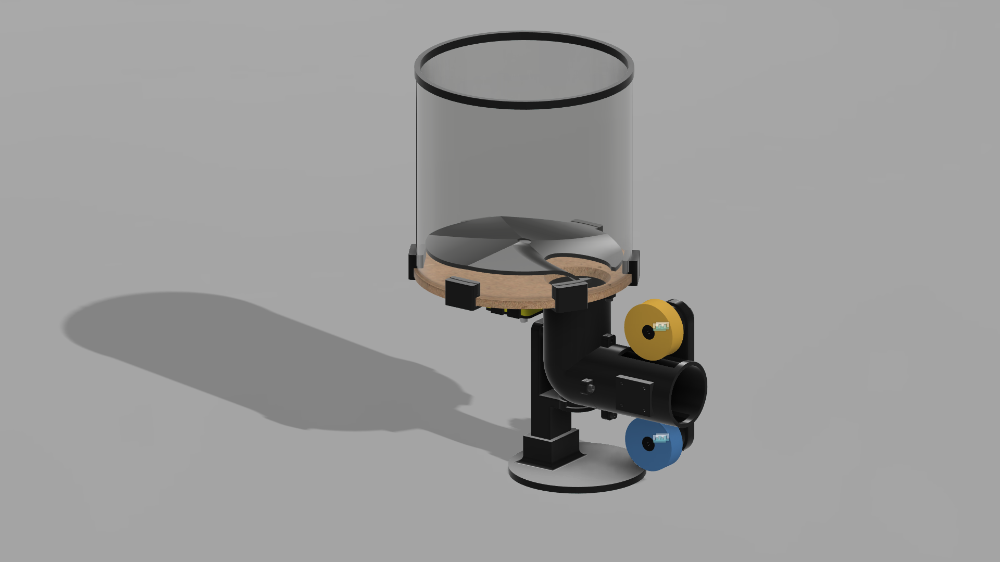
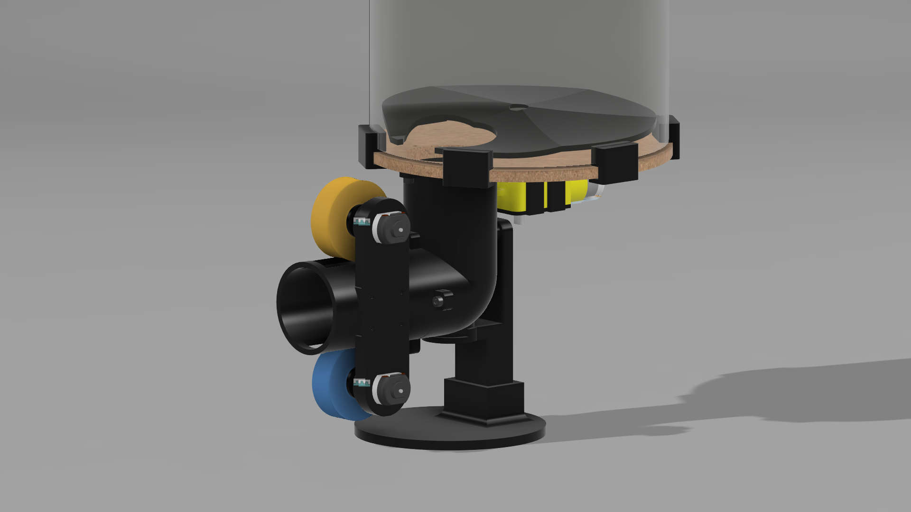

# Simple TT Robot

> **Warning: This project is still in its early stages. Expect frequent updates and potential breaking changes to the codebase. The first real release will be available on the [Releases](https://github.com/pserey/SimpleTTRobot/releases) page.**

This open-source Table Tennis Robot project is designed to be a realistic, affordable, and easy-to-build robot for training purposes. Below, links to various sections of this repository are available.

## Table of Contents

- [Introduction](#introduction)
- [Materials](#materials)
- [Build Guide](#build-guide)
- [Contributing](#contributing)
- [License](#license)

## Introduction

The Simple Table Tennis Robot was a personal project that tried to create a cheap alternative to every table tennis robot out there without losing on training capabilities. Now, the difference is it's an Open Source project 🏓

The main objective of this project is to use easy-to-find materials, electric components and microcontroller to make the building of it viable and cheap for anyone (mainly focused in the Brazilian market).

The whole design of the robot is heavily inspired in [this video](https://www.youtube.com/watch?v=-pSiuAdUKP4) from the channel [hiennguyenvan](https://www.youtube.com/@hiennguyenvan9777).

## Materials

### Physical/Hardware Materials
- 3D printed parts (CAD available)
- MDF laser-cut parts, or hand-cut if preferred (CAD available)
- IPong V300 flywheels (**the main focus now is developing non-propietary flywheels**)
- M3 and M4 screws and nuts
- Acrylic or cardboard sheets

### Electronic Components
- Arduino Nano or Uno microcontroller
- Connecting wires
- 1k and 2k resistors
- 2x 130-size 6V DC motors
- 1x 130-size 6V DC motor with gearbox
- 2x L298N H-Bridge motor drivers
- HC-05 Bluetooth receiver module
- LM393 Speed Sensor module
- 12V power supply

> Further detail of materials such as quantities will be added in a BOM format and updated at the README.md after the first release.

## Build Guide

> Build guide and circuit schema will be added with the first release. For now, only [build pictures](assets/build) are available.

## License

### CAD and documentation

The non-software components (3D CAD designs and documentation) are licensed under the Creative Commons Attribution-ShareAlike 4.0 International (CC BY-SA 4.0) License. See the [CAD-LICENSE](CAD-LICENSE.md) file for more details.

Shield: [![CC BY-SA 4.0][cc-by-sa-shield]][cc-by-sa]

This work is licensed under a
[Creative Commons Attribution-ShareAlike 4.0 International License][cc-by-sa].

[![CC BY-SA 4.0][cc-by-sa-image]][cc-by-sa]

[cc-by-sa]: http://creativecommons.org/licenses/by-sa/4.0/
[cc-by-sa-image]: https://licensebuttons.net/l/by-sa/4.0/88x31.png
[cc-by-sa-shield]: https://img.shields.io/badge/License-CC%20BY--SA%204.0-lightgrey.svg

### Code

The software components of this project are licensed under the MIT License. See the [LICENSE](LICENSE.md) file for more details.
